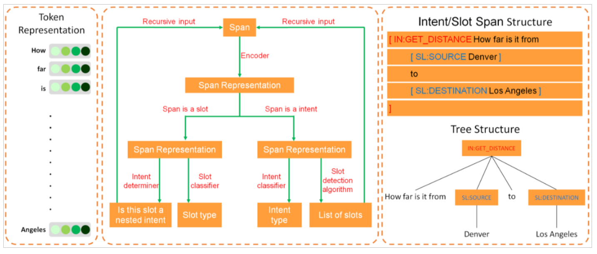
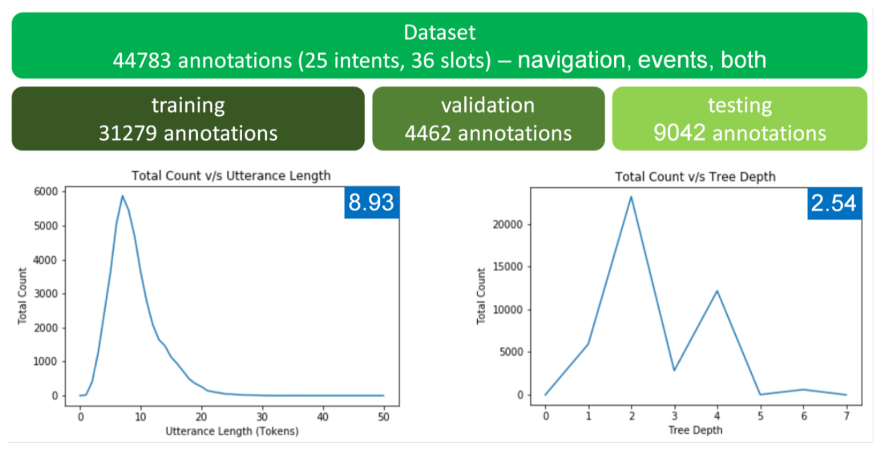

# Introduction

With the rise of intelligent assistants, understanding and correctly carrying an user query becomes an important topic. Semantic parsing of user queries is usually done by firstly classifying the intention of the user (which we call its _intent_), and secondly by identifying spans of texts corresponding to the parameters of the query (we call those parameters _slots_, and their actual occurence in the text _values_). However, this method is ineffective when parsing an input containing multiple queries, where the main query may be dependant on other queries. To solve this problem, _Gupta et al., 2018_ __[2]__ introduced a new representation of queries as trees, where slots can be considered as nested queries. Their model uses a Recurrent Neural Network Grammar (RNNG) (_Dyer et al., 2016_ __[5]__) to construct a tree by reading the input query token by tokens. In this paper, we wanted to see if others kinds of algorithms would give better results. In order to do that, we designed and implemented a model inspired by the top-down parsing algorithm of _Stern et al., 2017_ __[1]__.

# Methodology

We propose a novel algorithm for performing nested semantic parsing of an user query. Our goal is, given an user order, to produce a tree capturing all nested queries in this input. The characteristic of this tree are exactly the same as in _Gupta et al., 2017_ __[2]__, except in our implementation we do not allow text nodes : each node contains all the text of its span.  As outlined in in _Gupta et al., 2017_ __[2]__, such a tree must respect the following rules (which we modified to take into account our modified implementation) :

> * _The top level node must be an intent_
> * _An intent can only have slots as children_
> * _A slot can only have one intent as a child_

Our algorithm construct trees recursively from a top-down manner. Respecting such rules means that an alternation pattern has to be implemented : the top node is an intent, its children are slots, a potential slot child is an intent, this intent children are slots, _etc_... Therefor, we can divide our algorithm in two distinct stages.

## Intent Level

When the input of the algorithm is an intent (for example, at the top level), our algorithm performs two tasks :

* Classifying the intent
* Detecting slots

Intent classification is performed using a simple module composed of a fully connected neural network layer followed by a softmax activation function. This module takes as input the span representation (see the _span representation_ section) of the intent's text, and produces a probability distribution over all possible intent types.

Slot detection is the trickiest part of the algorithm. for an intent's text consisting of $t$ tokens, each n-gram (with $n = t - 1$) is considered as a candidate slot. Our model therefore learns to give a score to each n-gram. To do so, a different neural network is trained for each intent type\footnote{as we noticed during our experimentations, different intent types usually have different slots, therefore training a different model per intent type greatly enhances results}, and is used in conjonction to a softmax function to rate each n-gram. The model considers a specific n-gram as a slot when its score is above of a specific threshold. However, as conflicts may arise when two overlapping n-grams are chosen, one must choose a way to resolve those conflict to choose only non-overlapping spans as slots. Our implementation iterates over all n-grams, adding each of them in a list if the following conditions are satisifed : 

* The score of the candidate span is sufficient (in our implementation, it has to be greater than 0.5)
* If the candidate span overlaps with other spans in the list, its score has to be greater than the score of all those overlapping spans

At this level, the algorithm returns a tree whose root is the current intent, and having as children all results of the algorithm recursively launched on detected slots.

## Slot Levels

When the input of the algorithm is a slot, our algorithm also performs two tasks :

* Classifying the slot
* Checking wether or not the current slot is a nested intent

To classify the current slot, we also use a simple module composed of a fully connected neural network layer followed by a softmax function. However, for the same reason as slot detection at the intent level, we train a different network for each possible parent intent type, greatly enhancing classification performance.

Checking if a slot is also a nested intent is, once again, performed by a fully connected layer followed by a softmax function.

At this level, the algorithm returns a tree whose root is the current slot, and having as child an intent if it was found to be nested, or being a leaf node otherwise.

## Span Representation

Every time a module consisting of a fully connected neural network layer has been mentioned above, its input is a span representation. Such a span representation is obtained using a pre-trained SpanBERT model __[4]__. SpanBERT is a modified version of BERT, where training is done by making the model predict a span content using only its boundary tokens, and is therefore very well suited to reprensent spans of text. 

## Training

The training algorithm is different to the inference one. This is because of two reasons :

* At training time, we compare the generated tree with the gold tree for the current user order to generate a loss
* At training time, to train our slot-detection neural networks more efficiently, we do not solve conflicts between overlapping spans : instead, for each span score, we compare it with the score of this span in the gold tree (either 0 or 1)

At the intent level, the loss is a sum of :

* for the intent classification task, a cross entropy loss between the outputed probability distribution over possible intent types and the gold tree true intent type
* for the slot detection task, the sum of all cross entropy loss between span scores and the gold tree scores (0 or 1). The negative class of this cross entropy loss has weight $w_d = \frac{N}{N_g}$, where $N$ is the number of t-1-gram in the sentence with $t$ tokens, and $N_g$ the number of slots in the gold tree. 

At te slot level, the loss is a sum of :

* for the slot classification task, another cross entropy loss between the outputed probability distribution over all possible slot types and the gold tree true slot type 
* for the intent detection task, a cross entropy between the outputed score and the true score (0 if the gold tree doesn't contain a nested intent, 1 otherwise)

# Experiments

## Dataset

To compare our work with _Gupta et al., 2017_, we use their proposed dataset. It is composed of 44783 user queries, with 25 intent types and 36 slot types. The dataset focus is on navigation, events and navigation to events. Trees in this dataset have a mean depth of 2.54, while user queries have a mean length of 8.93 tokens. 35% of trees have a depth of more than 2 (which indicates a nested query). The dataset is split into training, validation and testing set with 70:10:20 ratio.

## Evaluation Metrics

Again, to compare our work with _Gupta et al. 2017_, we mainly use two metrics :

* Exact accuracy : Exact accuracy is the ratio of predicted trees that are _exactly equals_ to gold trees. This is a very harsh metric.
* Labeled Bracketing Precision, Recall and F1 : This metric is based of the number of spans correctly labeled. Labeled Bracketing Recall is based on the number of spans of the gold tree present and correctly labeled in the predicted tree, while Labeled Bracketing Precision is based on the number of correcty predicted spans labels of the predicted tree.

## Results

|       Model        | Exact Accuracy |
|:------------------:|:--------------:|
|_Gupta et al., 2017_|      78.51     |
|      _Ours_        |                |

|       Model        | LB-Precision | LB-Recall | LB-F1  |
|:------------------:|:------------:|:---------:|:------:|
|_Gupta et al., 2017_|      90.62   |    89.84  |  90.23 |
|       _Ours_       |              |           |        |

# Conclusion

# References

* __[1]__ _Stern M., Andreas J., Klein D. A Minimal Span-based neural constituency parser. arXiv preprint arXiv:1705.03919. 2017._
* __[2]__ _Gupta S., Shah R., Mohit M., Kumar A., Lewis M. Semantic Parsing for Task Oriented Dialog Using Hierarchical Representations. arXiv preprint arXiv:1810.07942. 2018._
* __[3]__ _Einolghozati A., Pasupat P., Gupta S., Shah R., Mohit M., Lewis M., Zettlemoyer L. Improving Semantic Parsing for Task Oriented Dialog. arXiv preprint arXiv:1902:06000. 2019._
* __[4]__ _Joshi M., Chen D., Liu Y., Weld D. S., Zettlemoyer L., Levy O. Spanbert : Improving Pre-training by Representing and Predicting Spans. arXiv preprint arXiv:1907.10529. 2019._
* __[5]__ _Dyer C., Kuncoro A., Ballesteros M., Smith N. A. Recurrent Neural Network Grammars. arXiv preprint arXiv:1602:07776. 2016._
